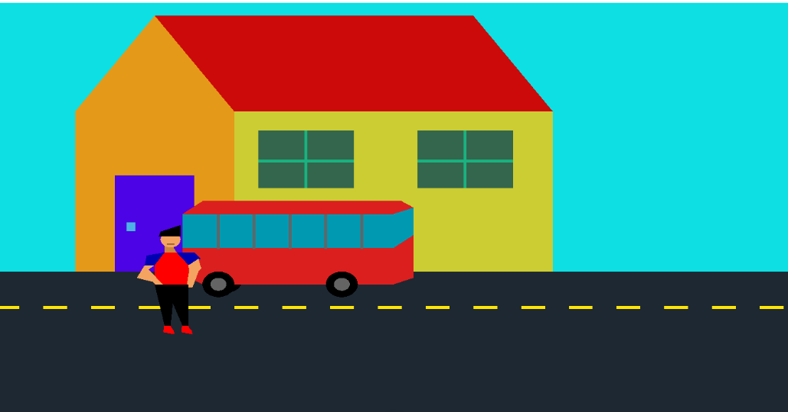
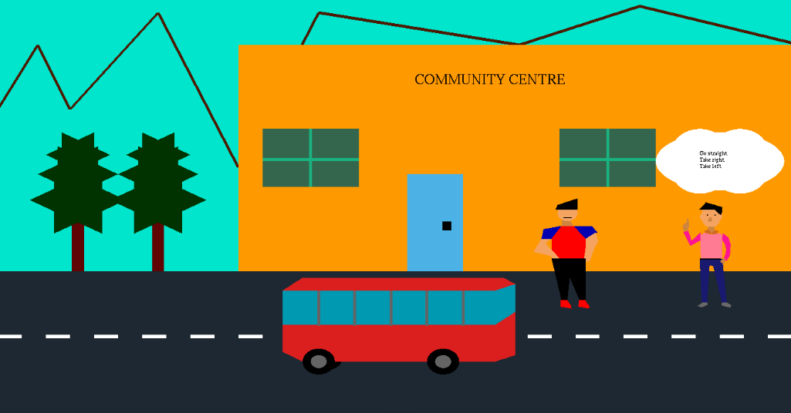
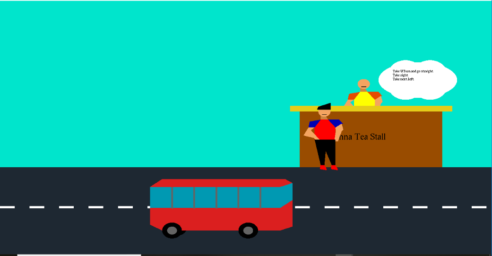
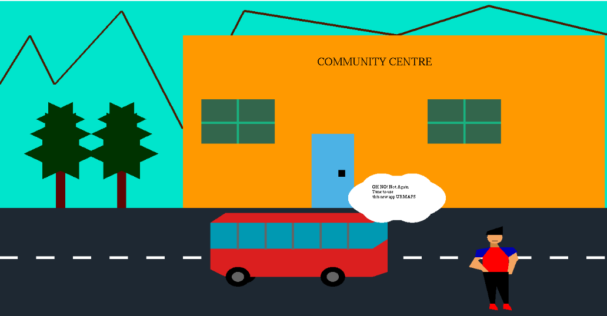
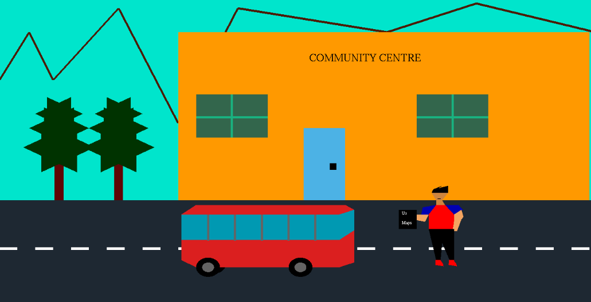
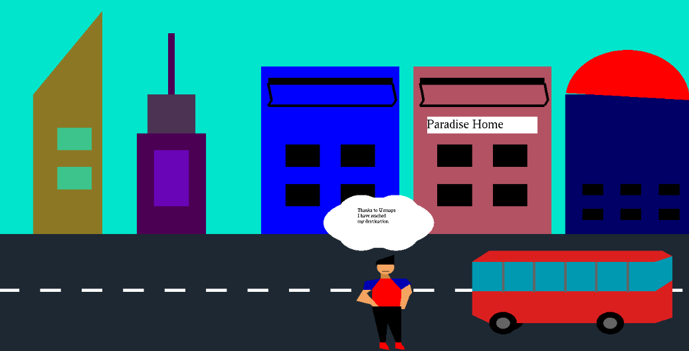

Web-Map-Simulation
============================================

An OPEN GL application to demonstrate the use of Web Map Apps as a business solution. 

It is a Computer Graphics project in which a narrative is demonstrated with help of animation. The story revolves around our central charachter, Rick who has to go from his home to his friend's place(Home Paradise). He ask for directions from stall owners and other people on the way, however finds himself stuck in the middle of nowhere. This is the moment he decides to use the Web Map App called as 'Urmaps'. Using the directions from the map, he reach his destination without any hassle.

**Running the Project:**
- Click on the clone/download button and download it as zip.
- Extract the zip by right clicking and extract it to your preferred location
- Open the project in Visual studio. The working code includes frame1.h-> frame7.h along with main.cpp that binds all the frames.
- Run urmaps.sln to see the animation

**Working/Keyboard shortcuts to use at each frame**
- frame1 : Rick leaves his home to go to the Home Paradise
	- Press m to move the car 
- frame 2 : Rick reaches a community centre and asks a person the directions to Home Paradise
	- Press m to move the car 
- frame3: The person gives directions to Home Paradise
	- Press x to enable Rick's cloud
	- Press c to enable person's cloud
	- Press m to move the car
- frame4 : Stuck again, Rick asks Munna the directions to Home Paradise. Munna tells the directions
	- Press x to enable Rick's cloud
	- Press c to enable Munna's cloud
	- Press m to move the car
- frame5 : Munna's direction leads Rick back to Community Centre. **DAMN!**. Rick decides to use Urmaps
	- Press b to enable Rick's cloud
- frame 6: Rick feeds in the location in the app. He reads the directions given by Urmaps
	- Press x to enable Rick's cloud
	- Press m to move the bus
- frame7 : Rick reaches the destination.
	- Press b to enable Rick's cloud

**Output**

